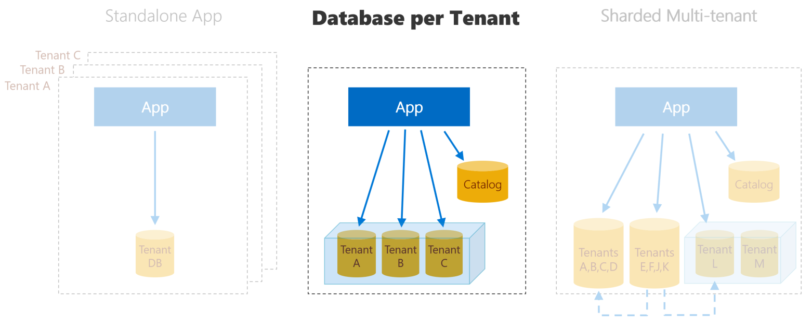

# MultiTenantNet
Multi Tenant Dotnet App (SaaS)

## Introduction

This is a multi-tenant application, one application (SaaS) with multiples database, each tenant has his own database with the same schema, 
the use of single-tenant databases gives strong tenant isolation.

If you need different schema in each single-tenant database this project is easy to change to allow that using multiples DbContext pattern.

This project use .Net Framework 6.2, Entity Framework 6.2, SimpleInjector as DI with the idea to be hosted on Azure using Azure SQL Elastic Database.

### Database per tenant SaaS pattern

This pattern is effective for service providers that are concerned with tenant isolation and want to run a centralized service (SaaS)
that allows cost-efficient use of shared resources. A database is created for each tenant automatic using a template database that you need to setup on your AppSetting. If you need to handle differet schemas you can do it using multiples DbContext pattern. 
Also they are hosted in Azure Elastic Pools to provide cost-efficient and easy performance management. 
A catalog database holds the mapping between tenants and their databases. This mapping is managed using the **shard map management** features of the Elastic Database Client Library, which also provides efficient connection management to the application.

## Get started 
